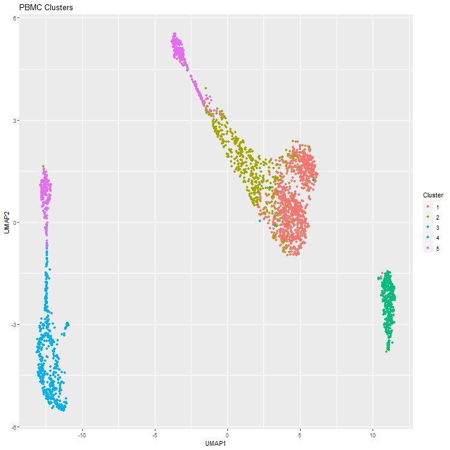
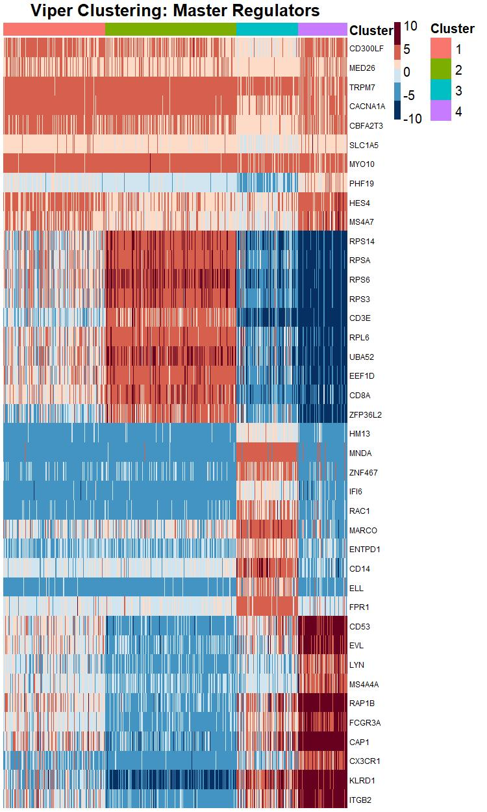

```{r, include = FALSE}
knitr::opts_chunk$set(
  collapse = TRUE,
  comment = "#>"
)
```

## Introduction

The pipeline for Protein Activity Inference in Single Cells (PISCES) is a regulatory-network-based methdology for the analysis of single cell gene expression profiles.

PISCES transforms highly variable and noisy single cell gene expression profiles into robust and reproducible protein activity profiles. PISCES  is centered around two key algorithms: the Algorithm for the Reconstruction of Accurate Cellular Networks ARACNe [1]; and the algorithm for  Virtual Inference of Protein-activity by Enriched Regulon analysis (VIPER/metaVIPER) [2,3].

## Install PISCES

To get started, you'll need to install several R packages:

```{r, eval = FALSE}
install.packages(c("cluster", "ggplot2", "devtools", "Seurat", 
                   "pheatmap", "BiocManager", "RColorBrewer"))
BiocManager::install("viper")
BiocManager::install("biomaRt")
devtools::install_github("JEFworks/MUDAN")
devtools::install_github(repo = "califano-lab/PISCES", force = TRUE, build_vignettes = TRUE)

library(cluster)
library(ggplot2)
library(Seurat)
library(viper)
library(PISCES)
```

## Gene Expression Clustering

The first step of the PISCES pipeline is to perform a clustering analysis in gene expression space. This allows for the separation of broadly different cell types prior to input to ARACNe, which is not designed to generate regulatory networks from heterogeneous data. 

To perform this analysis, we recommend using the Seurat package as shown below. This is just one of many alternatives - any validated methodolgoy of gene expression anaylsis should work here. However, Seurat is well documented as the industry standard. If you'd like to learn more about Seurat, visit the Satija lab page [LINK].

We first load the data and visualize some quality control metrics:

```{r, eval = FALSE}
data("pbmc", package = "PISCES")
seurat.obj <- CreateSeuratObject(counts = raw.mat, project = "PBMC", min.cells = 3, min.features = 200)
mt.features <- intersect(mt.genes$hum.ensg, rownames(seurat.obj))
seurat.obj[["percent.mt"]] <- PercentageFeatureSet(object = seurat.obj, features = mt.features)
QCPlots(seurat.obj)
```

Based on this plot, we choose filtration thresholds to remove low quality or outlier cells. Next, we normalize the data using the `SCTransform` function in Seurat:

```{r, eval = FALSE}
seurat.obj <- subset(seurat.obj, subset = nCount_RNA > 1000 & nFeature_RNA < 3000 & percent.mt < 10)
seurat.obj <- SCTransform(seurat.obj, vars.to.regress = "percent.mt", verbose = FALSE)
```

With the data filtered for QC and normalized, we now run a principal component analysis (PCA) and identify a feature set based on the amount of variance we want to capture. These features are then used to build a graph and identify populations with a silhouette score-optimized Louvain clustering:

```{r, eval = FALSE}
## run PCA and find neighbors
seurat.obj <- RunPCA(seurat.obj, verbose = FALSE)
pca.feature.num <- GetPCAFeats(seurat.obj, var.thresh = 0.9)
seurat.obj <- FindNeighbors(seurat.obj, dims = 1:pca.feature.num)
## cluster
dist.mat <- as.dist(sqrt(1 - cor(seurat.obj@assays$SCT@scale.data)))
seurat.obj <- SSLouvain(seurat.obj, dist.mat)
```

Finally, we'll pull a couple of matrices out of the Seurat object. Note that this step is not necessary; if you're comfortable working with the Seurat object, feel free to index into it to access these matrices as you need them. For the purposes of this vignette, saving this data as separate objects will make for easier interpretation.

```{r, eval = FALSE}
sct.mat <- seurat.obj@assays$SCT@scale.data
count.mat <- seurat.obj@assays$RNA@counts
clust.vect <- seurat.obj@active.ident
```

## Meta Cell Generation and ARACNe
With our gene expression clusters in hand, we now turn to network generation. In order to overcome the shallow depth of most single-cell data, metacells are generated within each cluster by summing up the reads in the `k` nearest neighbor of each cell. If you have a particularly high depth of sequencing, this step may not be necessary. Generally, generating a network from a cluster with fewer than 500 cells that also requires metacell inference due to low depth is inadvisable. In this tutorial, we lower that threshold slightly to permit network generation for three of our four clusters:

```{r, eval = FALSE}
meta.mats <- MetaCells(count.mat, dist.mat, clust.vect, min.samps = 480)
for (m.name in names(meta.mats)) {
  f.name <- paste('general-workflow/pbmc_c', m.name, '-meta.rds', sep = '')
  saveRDS(meta.mats[[m.name]], f.name)
}
```

These metacell matrices can now be used as input to ARACNe. In order to effectively do this, you'll need access to computational cluster, as the network generation process is quite computationally intense. PISCES comes with a set of scripts for running ARACNe, but these will likely need to be modified for use with your cluster architecture.

## MetaVIPER and Master Regulator Analysis

For the purposes of this vignette, we have pre-generated the networks necessary to analyze this PBMC dataset. We now load these networks and use them to infer protein activity using VIPER:

```{r, eval = FALSE}
## load networks
data("pbmc.nets", package = "PISCES")
## run metaVIPER
pbmc.vip <- viper(sct.mat, pbmc.nets, method = 'none')
```

Next, we generate a distance matrix and find the optimal clustering using silhouette score optimized Louvain clsutering:

```{r, eval = FALSE}
pbmc.vip.dist <- as.dist(1 - as.matrix(viperSimilarity(pbmc.vip)))
vip.clust <- LouvainResRange(pbmc.vip, dist.mat = pbmc.vip.dist, rmax = 310, rstep = 25)
opt.clust <- sort(vip.clust$clusterings[[which.max(vip.clust$sils)]])
```

Finally, we identify the Master Regulators (the proteins that are most differentially active between clusters) using a Mann Whitney U-Test. Before running this test, we transform from ENSG to gene names for ease of interpretation:

```{r, eval = FALSE}
pbmc.vip.gn <- GeneNameConvert(pbmc.vip, 'human', 'ensg', 'gn')
vip.mrs <- MWUMrs(pbmc.vip.gn, opt.clust)
```

## Visualization

There are two primary avenues of visualization used in PISCES: scatter plots and heatmaps. Scatter plots are useful for getting a rough idea of what the data may look like or for overlaying the activity of specific proteins of interest with clustering solutions. Heatmaps, however, are a superior way of representing data with as many dimensions as a gene expression of protein activity matrix:

We first generate a UMAP representation of the protein activity matrix, then generate a scatter plot showing the cluster labes:

```{r, eval = FALSE}
vip.umap <- CustomUMAP(pbmc.vip)
## scatter plot
plot.dat <- data.frame('UMAP1' = vip.umap$layout[names(opt.clust),1], 
                       'UMAP2' = vip.umap$layout[names(opt.clust),2],
                       'Cluster' = as.factor(opt.clust))
ggplot(plot.dat, aes(UMAP1, UMAP2)) + geom_point(aes(color = Cluster)) + ggtitle('PBMC Clusters')
```


Finally, we plot a heatmap of the master regulators for this clustering solution:

```{r, eval = FALSE}
## create plot matrix
num.mrs <- 25
cell.order <- names(opt.clust)
mr.set <- sapply(vip.mrs, function(x) {names(x$positive[1:num.mrs])})
mr.set <- unique(unlist(as.list(mr.set)))
plot.mat <- pbmc.vip.gn[mr.set, cell.order]
## set colors and annotations
mat.breaks <- QuantileBreaks(plot.mat)
annot.df <- data.frame('Cluster' = opt.clust[cell.order])
clust.colors <- ClusterColors(length(unique(opt.clust))); names(clust.colors) <- unique(opt.clust)
annot.color <- list('Cluster' = clust.colors)
## generate pheatmap
pheatmap(plot.mat, main = 'Viper Clustering: Master Regulators', fontsize = 20,
         annotation_col = annot.df, annotation_colors = annot.color,
         cluster_cols = FALSE, show_colnames = FALSE,
         cluster_rows = FALSE, show_rownames = TRUE, fontsize_row = 8,
         breaks = mat.breaks, color = ColorLevels(length(mat.breaks) - 1, 'vip'))
```


## Downstream Analysis

Any further analysis should focus on leverage the master regulators identified by PISCES. These proteins are ideal experimetnal validation candidates or can be used to train machine learning models, for instances.


