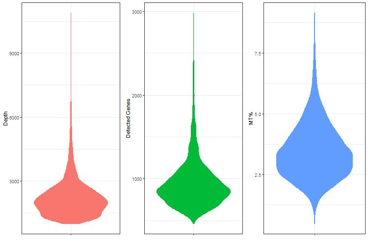
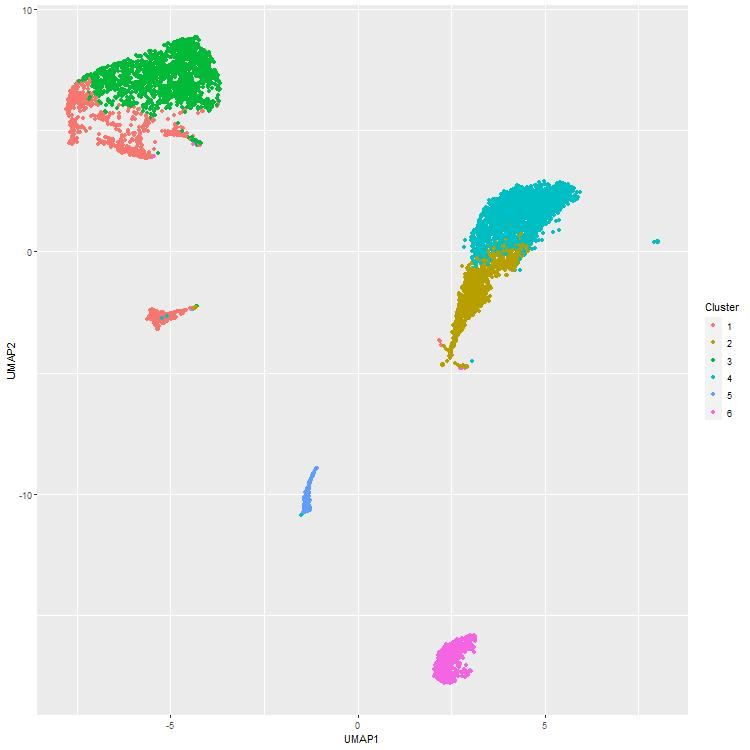
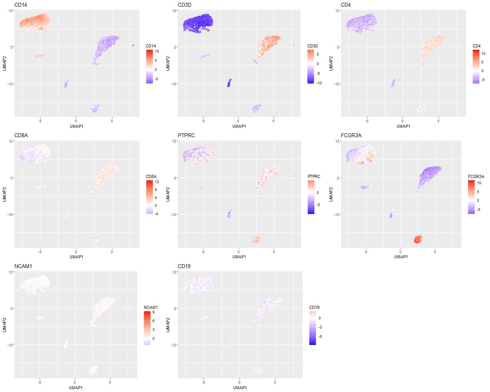
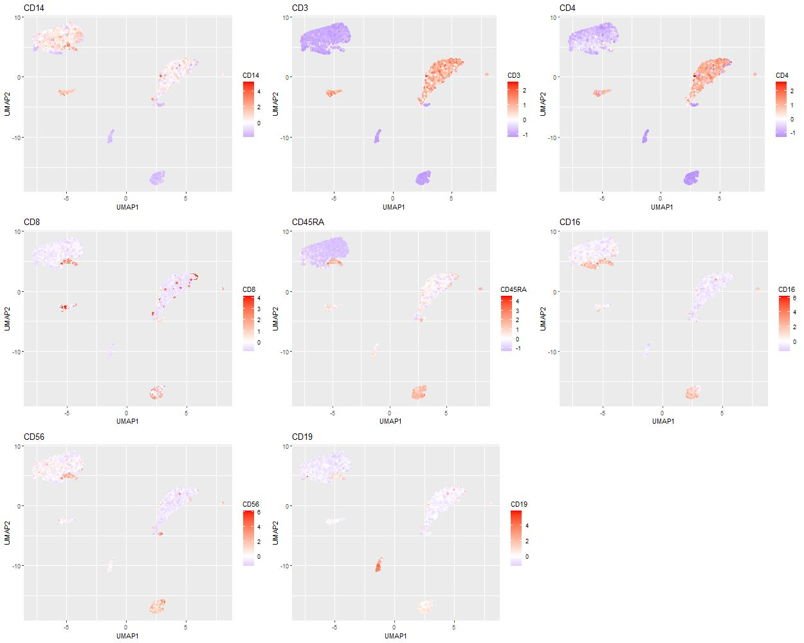
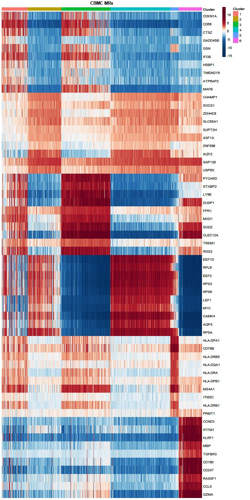

### Introduction

The pipeline for Protein Activity Inference in Single Cells (PISCES) is a regulatory-network-based methdology for the analysis of single cell gene expression profiles.

PISCES transforms highly variable and noisy single cell gene expression profiles into robust and reproducible protein activity profiles. PISCES  is centered around two key algorithms: the Algorithm for the Reconstruction of Accurate Cellular Networks ARACNe [1]; and the algorithm for  Virtual Inference of Protein-activity by Enriched Regulon analysis (VIPER/metaVIPER) [2,3].

Briefly, the ARACNe  algorithm is  one of the most widely used methods for inferring transcriptional interactions from gene expression data. The VIPER algorithm uses the expression of the ARACNe-inferred regulatory targets of a given protein, such as the targets of a transcription factor (TF), as an accurate reporter of its activity. Typically, PISCES  can accurately assess the activity of up to 6000 regulatory proteins  from single cell gene expression profiles,  significantly increasing the ability to analyze the biological function and relevance of gene products whose mRNAs are undetectable in individual cells (e.g. dropout effect).

### Setup

PISCES is implemented in R and requires the following packages:

* viper (v1.18.1)
* Seurat
* MUDAN
* biomaRt
* uwot
* Matrix
* ggplot2
* ggpubr
* pheatmap
* RColorBrewer

You can install these packages, along with PISCES itself, with the following code:

```{r eval=FALSE}
## CRAN packages
install.packages("BiocManager", "devtools",
                 "ggplot2", "ggpubr", "RColorBrewer", "pheatmap",
                 "Seurat", "uwot")
## BioConductor packages
BiocManager::install("viper")
BiocManager::install("biomaRt")
## GitHub packages
devtools::install_github("JEFworks/MUDAN")
devtools::install_github("califano-lab/PISCES")
```

To get started in this vignette, load the packages and data you'll need into your workspace:

```{r eval=FALSE}
library(PISCES)
library(Seurat)
library(ggplot2)
library(ggpubr)

## load data
load(system.file("extdata", "cbmc_rna.rda", package = 'PISCES'))
load(system.file("extdata", "cbmc_networks.rda", package = 'PISCES'))
load(system.file("extdata", "cbmc_abt.rda", package = 'PISCES'))
load(system.file("extdata", "abt_map.rda", package = 'PISCES'))
```

Before continuing, here's a brief overview of what we've loaded:
* cbmc_rna: the count matrix for the CBMC data
* cbmc_networks: ARACNe networks generated from the CBMC data, used for VIPER inference further down
* cbmc_abt: count matrix for the antibodies measured in the CITEseq experiment
* abt_map: a mapping from the antibody names to their gene / protein names in gene expression or VIPER space

### QC and Normalization

The first phase of the PISCES pipeline involves data QC and normalization. For QC thresholds, we recommend a brief visual inspection of your data using the `QCPlots` function, before filtration for read count, feature count, and mitochondrial gene percentage. The data are then normalized for sequenced dapth and scaled. 

For the most part, we accomplish this using the Seurat functions you may already be familiar with for data filtration, normalization, and scaling. Note that other methodologies (for instance, CPM normalization and an internal z-score scaling) can also be applied at this stage. 


```{r eval=FALSE}
## create seurat object
seurat.obj <- CreateSeuratObject(counts = cbmc_rna, project = 'cbmc_citeseq', min.cells = 3, min.features = 200)

## QC analysis
mt.features <- intersect(mt.genes$hum.symb, rownames(seurat.obj))
seurat.obj[["percent.mt"]] <- PercentageFeatureSet(object = seurat.obj, features = mt.features)
QCPlots(seurat.obj)

## filtration and SCT normalization
seurat.obj <- subset(seurat.obj, subset = nCount_RNA > 1000 & nFeature_RNA < 3000 & percent.mt < 10)
seurat.obj <- SCTransform(seurat.obj, vars.to.regress = 'percent.mt', verbose = FALSE)
seurat.obj <- CorDist(seurat.obj)
```


### Gene Expression Clustering

Remaining in gene expression space, we now perform a course clustering of the data using Seurat's built in clustering methodology (once again, other methods could be substituted here). This step is performed in order to generate clusters with broadly similar cell types for ARACNe network generation, as networks generated from heterogenous populations will not accurately reflect the regulatory architecture of the sample.

```{r eval=FALSE}
## seurat gene expression clustering
seurat.obj <- RunPCA(seurat.obj, verbose = FALSE)
seurat.obj <- FindNeighbors(seurat.obj, dims = 1:30, verbose = FALSE)
seurat.obj <- FindClusters(seurat.obj, resolution=seq(0.1,1,by=0.1), verbose = FALSE, algorithm=1) 

## identify optimal clustering by silhouette score
seurat.obj <- CorDist(seurat.obj)
sil.list <- list()
for (i in seq(0.1, 1, by = 0.1)) {
  clust.name <- paste('SCT_snn_res.', i, sep = '')
  clust.vect <- as.numeric(seurat.obj[[clust.name]][,1])
  sil.list[[clust.name]] <- mean(cluster::silhouette(clust.vect, seurat.obj@assays$SCT@misc$dist.mat)[,3])
}
```

### Network Generation

From the clustering generated in gene expresion space, PISCES builds cluster-specific metacells in order to combat the low-depth of single-cell sequencing. This is accomplished through a KNN graph, with k neighbors pooled into one metacell that is then re-normalized for depth. This process is repeated on each cluster with enough data - typically at least 500 cells are recommended:

```{r eval=FALSE}
meta.mats <- MetaCells(as.matrix(seurat.obj@assays$RNA@counts), seurat.obj@assays$SCT@misc$dist.mat, 
                       seurat.obj$seurat_clusters, min.samps = 500, num.neighbors = 10)
for (m.name in names(meta.mats)) {
  f.name <- paste(bootcamp.dir, 'cbmc_c', m.name, '-meta.rds', sep = '')
  saveRDS(meta.mats[[m.name]], f.name)
}
```

These metacell matrices can then be used as input to ARACNe. ARACNe typically requires an HPC and we do not cover it's use extensively in this tutorial. See the ARACNe-AP github on the Califano Lab page for more details. To continue with this tutorial, use the provided `cbmc_networks` objects to for protein activity inferene below.

### Protein Activity Inference

With networks generated, the next step is to run MetaVIPER to generate the protein activity signature. First, a new `PISCES` assay is created and added to the seurat object, and the data is re-normalized using CPM. Next, a gene expression signature is generated. In this instance, we perform an internal z-score scaling to generate the signature, but you could also generate a signature against an external reference. 

```{r eval=FALSE}
## generate PISCES object; normalize, generate internal GES
seurat.obj <- AddPISCESAssay(seurat.obj)
seurat.obj <- CPMTransform(seurat.obj)
seurat.obj <- GESTransform(seurat.obj)
```

So long as there is an object called `ges` in the `misc` object of the PISCES assay, VIPER can be run with the following command to generate the protein activity matrix. This matrix will then be stored in the `scale.data` field of the PISCES assay.

```{r eval=FALSE}
## run viper
seurat.obj <- PISCESViper(seurat.obj, cbmc_networks)
```

### Clustering

Next, we re-cluster the data based on protein activity using silhouette-optimized louvain clustering. Note that a distance matrix must first be generated using tAs before, other clustering methods could be applied at this stage - we leave it to the user to decide what approach is most appropriate for their data. 

```{r eval=FALSE}
# cluster
seurat.obj <- CorDist(seurat.obj)
seurat.obj <- LouvainResRange(seurat.obj, rmin = 10, rmax = 100) 

# generate umap and visualize clusters
seurat.obj <- MakeUMAP(seurat.obj)
PlotClusters(seurat.obj)
```


For this tutorial, we have a set of relavent markers to examine; those for which we have antibody readout from CITEseq. PISCES can automatically plot the activity of a set of markers with the following function:

```{r eval=FALSE}
MarkerGrid(seurat.obj, abt_map$vip)
```


The amount of antibody detected can also be plotted on the same scatter plot as follows:

```{r eval=FALSE}
# make plot data
plot.dat <- data.frame('UMAP1' = vip.obj@assays$PISCES@misc$umap[,1], 'UMAP2' = vip.obj@assays$PISCES@misc$umap[,2])
plot.dat <- cbind(plot.dat, t(cbmc_abt)[rownames(plot.dat), abt_map$abt])
# make plots
plot.list <- list()
for (p in colnames(plot.dat)[3:ncol(plot.dat)]) {
  plot.list[[p]] <- ggplot(plot.dat, aes(UMAP1, UMAP2)) + geom_point(aes_string(color = p)) +
    ggtitle(p) + scale_colour_gradient2(low = 'blue', mid = 'white', high = 'red')
}
# arrange
nCol <- min(3, length(plot.list))
nRow <- ceiling(length(plot.list) / nCol)
# plot object
plot.obj <- ggpubr::ggarrange(plotlist = plot.list, ncol = nCol, nrow = nRow)
print(plot.obj)
```


### Master Regulator Analysis

Finally, we can identify candidate master regulators for each population in our data set. In PISCES, this is done with a Mann-Whitney U-test comparing the activity in each cluster to the rest of the data. This data is best visualized in a heatmap, which can be done using the built in function in PISCES:

```{r eval=FALSE}
## generate and visualize MRs
vip.obj <- MWUMrs(seurat.obj)
MRHeatmap(seurat.obj)
```


### Downstream Analysis

This is only the starting point. PISCES analysis can be extended further to trajectory analysis, machine learning paradigms, or more nuanced clustering methodology, just to name a few possibilities.

